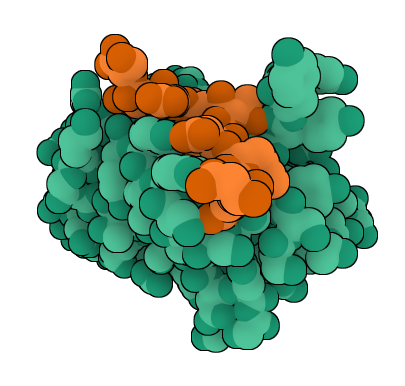
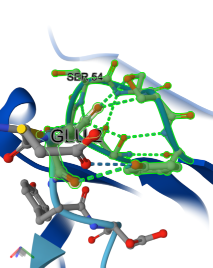

# 🧬 PIA-KRASv2-Nb: A High-Affinity Nanobody against KRAS


This repository documents the *in silico* design and validation of the **PIA-KRASv2-Nb** nanobody, a therapeutic molecule targeting the accessible `DEYDPTIEDS` epitope of the KRAS oncoprotein.



> 📌 *Structural model generated with AlphaFold-Multimer v3 (seed 72), which yielded an **ipTM score of 0.78** and a **pTM score of 0.92**.*

---

### 📣 **WORK PUBLISHED AS A PREPRINT!** 📣

This project has been officially published as a preprint on **Zenodo** & **Research Square**. It is now a citable and permanent part of the scientific record.

[](https://doi.org/10.5281/zenodo.16578455)
[](https://doi.org/10.21203/rs.3.rs-7239936/v1)  
[](https://www.researchsquare.com/article/rs-7239936/v1)  
[](https://creativecommons.org/licenses/by-nc/4.0/)

**Access the official publication here:
[https://doi.org/10.5281/zenodo.16578455](https://doi.org/10.5281/zenodo.16578455)
[https://doi.org/10.21203/rs.3.rs-7239936/v1](https://doi.org/10.21203/rs.3.rs-7239936/v1)**


---


## 🔬 Key Structural Insights

### 🎯 **Epitope Recognition Mechanism**
The nanobody establishes **34 interfacial contacts** (<4Å) with KRAS, organized into three functional clusters:

1. **Polar Core**  
   - 5 strong SER→GLU24 interactions (2.20-3.66Å)  
   - Anchored by SER54-GLU24 (2.20Å, shortest bond)

2. **Aromatic Network**  
   - TYR100-THR28 stacking (2.08Å OH-π)  
   - TYR57-ASP23 anion-π interaction (2.63Å)

3. **Hydrophobic Contacts**  
   - TRP47-ASP31 (2.61Å)  
   - ILE51-PRO27 (3.71Å)


*Central polar cluster with 7 coordinated interactions*

---


## 🔍 Objective

To design a **100% humanized, stable, and specific nanobody** that recognizes a functionally critical epitope of KRAS with high affinity, proposing it as a viable candidate for immunotherapy and molecular diagnostics.

---

## 🔧 Tools Used

- [AlphaFold-Multimer v3](https://alphafoldserver.com/)
- Tools from the SAbPred server (Oxford Protein Informatics Group):
  - [Therapeutic Antibody Profiler (TAP)](https://opig.stats.ox.ac.uk/webapps/sabdab-sabpred/sabpred/tap)
  - [ANARCI](https://opig.stats.ox.ac.uk/webapps/sabdab-sabpred/sabpred/anarci)
  - [SCALOP](https://opig.stats.ox.ac.uk/webapps/sabdab-sabpred/sabpred/scalop)
  - [NanoBodyBuilder2](https://opig.stats.ox.ac.uk/webapps/sabdab-sabpred/sabpred/nanobodybuilder2)
  - [Hu-mAb (Humanization Classifier)](https://opig.stats.ox.ac.uk/webapps/sabdab-sabpred/sabpred/humab)

### Interactive Validation
Explore the interaction analysis in our Colab notebook:  
[](https://colab.research.google.com/drive/1qyyJtn2fAQABQcl6zN6a3IkVf89yknDh?usp=sharing)  
*(Generates detailed contact maps and CSV exports)*

---

## 📂 Repository Contents
- 🇬🇧 [**`PIA-KRASv2-Nb_Report_ENG.pdf`**](./PIA-KRASv2-Nb_Report_ENG.pdf): Full scientific report in English.
- 🇪🇸 [**`PIA-KRASv2-Nb_Report_ESP.pdf`**](./PIA-KRASv2-Nb_Report_ESP.pdf): Full scientific report in Spanish.
- 📁 [**`AlphaFold_models/`**](./AlphaFold_models/): 3D structures of the elite seeds (`.cif` format).
- ⚖️ [**`LICENSE.md`**](./LICENSE.md): Detailed project license (CC BY-NC 4.0).
- 📁 [**`AlphaFold_images/`**](./AlphaFold_images/): images of the Structural model and Central polar cluster.
- 📁 [**`Interactions/`**](./Interactions/): Validation_Colab.ipynb # Interactive analysis

---

## 📌 Key Sequences

### PIA-KRASv2-Nb Nanobody (FASTA)
```
>PIA-KRASv2-Nb_Original_Sequence
EVQLVESGGGLVQPGGSLRLSCAASGFTFSSYAMSWVRQAPGKGLEWVSSISSSSSYIYYADSVKGRFTISRDNSKNTLYLQMNSLRAEDTAVYYCARDYYYGMDVWGQGTTVTVSSDIQ
```

```
>KRAS_epitope_DEYDPTIEDS
DEYDPTIEDS
```

---

📈 Key Results

| Parameter                   | Value      | Tool                            |
| :-----------------------    | :--------- | :------------------------------ |
| ipTM (Binding Confidence)   | **0.78**   | AlphaFold-Multimer v3 (Seed 72) |
| pTM (Global Structure)      | **0.92**   | AlphaFold-Multimer v3           |
| Humanization (Family)       | ✅ **1.0** | Hu-mAb (Human VH3 Family)       |
| RMSD (CDR3 Stability)       | **0.19 Å** | NanoBodyBuilder2                |

---

## 🧪 Proposed Applications

**Targeted Therapy:** Direct and pan-mutant inhibition of KRAS signaling.

**Molecular Diagnostics:** Development of high-affinity, epitope-specific biosensors.

**Protein Engineering:** As a scaffold for bivalent formats or antibody-drug conjugates (ADCs).

---

## 🤝 Contact & Collaboration
This project is open to experimental validation. If you work in immunotherapy, structural biology, or cellular assays and are interested in collaborating, please contact the author:

## [📧 Nacho Peinador](mailto:joseignacio.peinador@gmail.com)

---

## 📄 License
This project is licensed under the Creative Commons Attribution-NonCommercial 4.0 International.

This work has been registered with the Spanish Intellectual Property Registry (RPI) to establish a verifiable proof of authorship and creation date. Please see the LICENSE.md file for the full terms, including conditions for commercial licensing.
