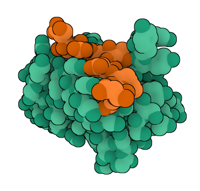

# 🧬 PIA-KRASv2-Nb: A High-Affinity Nanobody against KRAS


This repository documents the *in silico* design and validation of the **PIA-KRASv2-Nb** nanobody, a therapeutic molecule targeting the accessible `DEYDPTIEDS` epitope of the KRAS oncoprotein.



> 📌 *Structural model generated with AlphaFold-Multimer v3 (seed 72), which yielded an **ipTM score of 0.78** and a **pTM score of 0.92**.*

---

## 🔍 Objective

To design a **100% humanized, stable, and specific nanobody** that recognizes a functionally critical epitope of KRAS with high affinity, proposing it as a viable candidate for immunotherapy and molecular diagnostics.

---

## 🔧 Tools Used

- [AlphaFold-Multimer v3](https://alphafoldserver.com/)
- Tools from the SAbPred server (Oxford Protein Informatics Group):
  - [Therapeutic Antibody Profiler (TAP)](https://opig.stats.ox.ac.uk/webapps/sabdab-sabpred/sabpred/tap)
  - [ANARCI](https://opig.stats.ox.ac.uk/webapps/sabdab-sabpred/sabpred/anarci)
  - [SCALOP](https://opig.stats.ox.ac.uk/webapps/sabdab-sabpred/sabpred/scalop)
  - [NanoBodyBuilder2](https://opig.stats.ox.ac.uk/webapps/sabdab-sabpred/sabpred/nanobodybuilder2)
  - [Hu-mAb (Humanization Classifier)](https://opig.stats.ox.ac.uk/webapps/sabdab-sabpred/sabpred/humab)

---

## 📂 Repository Contents

- 🇬🇧 [**`PIA-KRASv2-Nb_Report_ENG.pdf`**](./PIA-KRASv2-Nb_Report_ENG.pdf): Full scientific report in English.
- 🇪🇸 [**`PIA-KRASv2-Nb_Report_ESP.pdf`**](./PIA-KRASv2-Nb_Report_ESP.pdf): Full scientific report in Spanish.
- 📁 [**`AlphaFold_models/`**](./AlphaFold_models/): 3D structures of the elite seeds (`.cif` format).
- ⚖️ [**`LICENSE.md`**](./LICENSE.md): Detailed project license (CC BY-NC 4.0).

---

## 📌 Key Sequences

### PIA-KRASv2-Nb Nanobody (FASTA)
```
>PIA-KRASv2-Nb_Original_Sequence
EVQLVESGGGLVQPGGSLRLSCAASGFTFSSYAMSWVRQAPGKGLEWVSSISSSSSYIYYADSVKGRFTISRDNSKNTLYLQMNSLRAEDTAVYYCARDYYYGMDVWGQGTTVTVSSDIQ
```

```
>KRAS_epitope_DEYDPTIEDS
DEYDPTIEDS
```

---

📈 Key Results

| Parameter                   | Value      | Tool                            |
| :-----------------------    | :--------- | :------------------------------ |
| ipTM (Binding Confidence)   | **0.78**   | AlphaFold-Multimer v3 (Seed 72) |
| pTM (Global Structure)      | **0.92**   | AlphaFold-Multimer v3           |
| Humanization (Family)       | ✅ **1.0** | Hu-mAb (Human VH3 Family)       |
| RMSD (CDR3 Stability)       | **0.19 Å** | NanoBodyBuilder2                |

---

## 🧪 Proposed Applications

**Targeted Therapy:** Direct and pan-mutant inhibition of KRAS signaling.

**Molecular Diagnostics:** Development of high-affinity, epitope-specific biosensors.

**Protein Engineering:** As a scaffold for bivalent formats or antibody-drug conjugates (ADCs).

---

## 🤝 Contact & Collaboration
This project is open to experimental validation. If you work in immunotherapy, structural biology, or cellular assays and are interested in collaborating, please contact the author:

## [📧 Nacho Peinador](mailto:joseignacio.peinador@gmail.com)

---

## 📄 License
This project is licensed under the Creative Commons Attribution-NonCommercial 4.0 International.

This work has been registered with the Spanish Intellectual Property Registry (RPI) to establish a verifiable proof of authorship and creation date. Please see the LICENSE.md file for the full terms, including conditions for commercial licensing.
