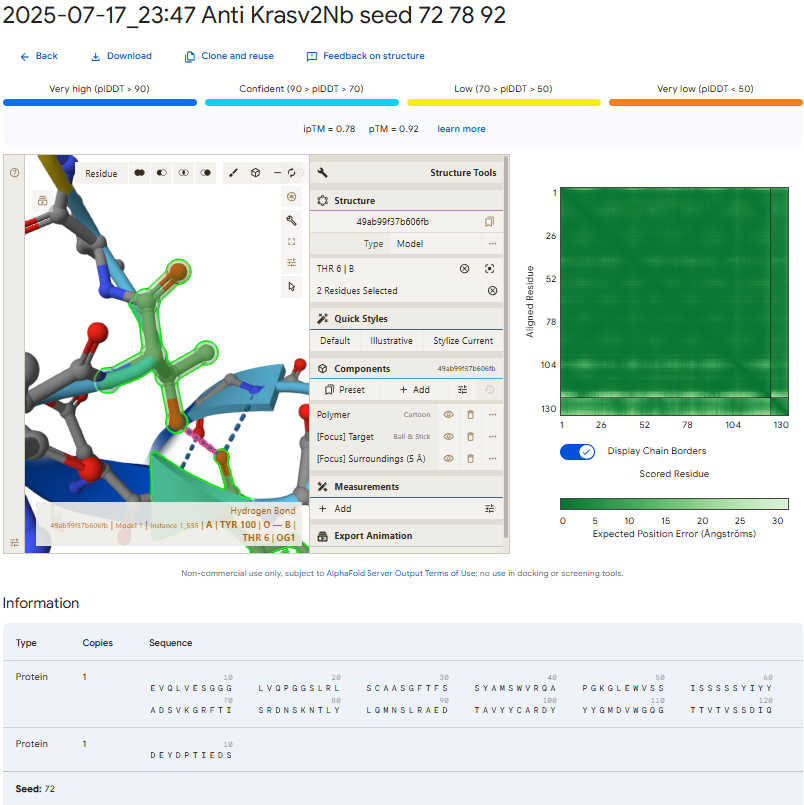
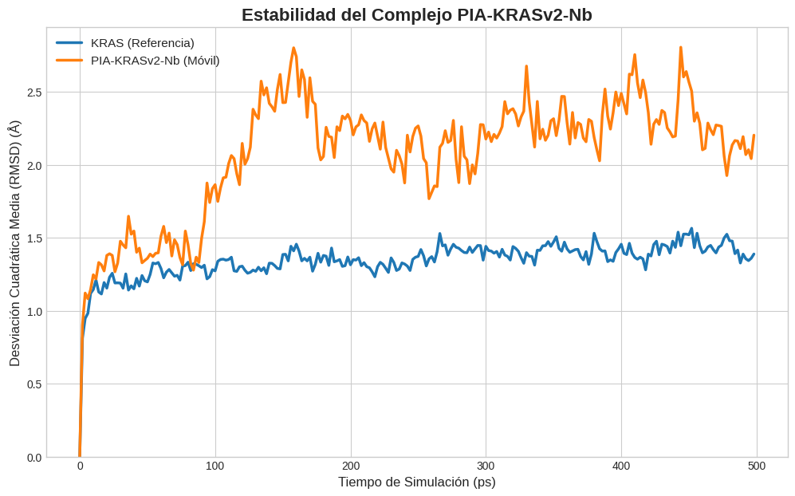

# 🧬 PIA-KRASv2-Nb: A High-Affinity Nanobody against KRAS

[-blue)](https://doi.org/10.5281/zenodo.16578455)
 

This repository documents the *in silico* design of **PIA-KRASv2-Nb**, a therapeutic nanobody targeting the accessible `DEYDPTIEDS` epitope of the KRAS oncoprotein. **This design's stability and binding persistence have been rigorously confirmed through molecular dynamics (MD) simulations.**

> 📌 *Structural model generated with AlphaFold-Multimer v3 (seed 72), yielding an **ipTM score of 0.78** and a **pTM score of 0.92**.*

---

## 🔬 Dynamic Validation & Stability Analysis

A key part of this project was to validate that the static, predicted binding pose is stable under dynamic, physiological conditions. A 500-picosecond MD simulation was performed, confirming the remarkable stability of the complex.

> 📌 *The complex demonstrates exceptional stability over 500 ps, converging to a low RMSD plateau (~2.2 Å). This confirms a persistent and robust binding pose.*

For a detailed walkthrough of the simulation and analysis, you can run the notebook directly in Google Colab:

---

## 🎯 Key Structural Insights

The nanobody establishes **34 interfacial contacts** (<4Å) with KRAS, organized into three functional clusters:

1.  **Polar Core**: 5 strong SER→GLU24 interactions (2.20-3.66Å), anchored by SER54-GLU24 (2.20Å).
2.  **Aromatic Network**: TYR100-THR28 stacking (2.08Å OH-π) and TYR57-ASP23 anion-π interaction (2.63Å).
3.  **Hydrophobic Contacts**: Including TRP47-ASP31 (2.61Å) and ILE51-PRO27 (3.71Å).

*Central polar cluster with 7 coordinated interactions.*

---

## 📂 Repository Contents
- 🇬🇧 [**`PIA-KRASv2-Nb_Report_ENG.pdf`**](./PIA-KRASv2-Nb_Report_ENG.pdf): Full scientific report in English.
- 🇪🇸 [**`PIA-KRASv2-Nb_Report_ESP.pdf`**](./PIA-KRASv2-Nb_Report_ESP.pdf): Full scientific report in Spanish.
- 💻 [**`MD_Simulation/`**](./MD_Simulation/): Google Colab notebook for the Molecular Dynamics simulation and the resulting RMSD plot.
- 📁 [**`AlphaFold_models/`**](./AlphaFold_models/): 3D structures of the elite seeds (`.cif` format).
- ⚖️ [**`LICENSE.md`**](./LICENSE.md): Detailed project license (CC BY-NC 4.0).

*(See the full list of tools used in the scientific report)*

---

## 📈 Key Results

| Parameter                   | Value                       | Tool / Method                   |
| :-------------------------- | :-------------------------- | :------------------------------ |
| ipTM (Binding Confidence)   | **0.78**                    | AlphaFold-Multimer v3 (Seed 72) |
| pTM (Global Structure)      | **0.92**                    | AlphaFold-Multimer v3           |
| **Dynamic Stability (MD)**  | ✅ **Stable (~2.2 Å)**        | OpenMM Simulation               |
| Humanization (Family)       | ✅ **1.0**                    | Hu-mAb (Human VH3 Family)       |
| RMSD (CDR3 Stability)       | **0.19 Å**                  | NanoBodyBuilder2                |

---

## 🧪 Proposed Applications

- **Targeted Therapy:** Direct and pan-mutant inhibition of KRAS signaling.
- **Molecular Diagnostics:** Development of high-affinity, epitope-specific biosensors.
- **Protein Engineering:** As a scaffold for bivalent formats or antibody-drug conjugates (ADCs).

---

## 🤝 Contact & Collaboration
This project is open to experimental validation. If you work in immunotherapy, structural biology, or cellular assays and are interested in collaborating, please contact the author:

### [📧 Nacho Peinador](mailto:joseignacio.peinador@gmail.com)
**ORCID:** [https://orcid.org/0009-0008-1822-3452](https://orcid.org/0009-0008-1822-3452)

---

## 📄 License
This project is licensed under the Creative Commons Attribution-NonCommercial 4.0 International.

This work has been registered with the Spanish Intellectual Property Registry (RPI) to establish a verifiable proof of authorship and creation date. Please see the LICENSE.md file for the full terms, including conditions for commercial licensing.
